  <h1>Hi there, I'm lone17k 👋</h1>
  
<b>Full-Stack Developer | Desktop Apps | Machine Learning | Game Scripter</b>

---

### 🚀 About Me

I build high-performance desktop applications and immersive game scripts, with a strong focus on data processing and computer vision. 

- 🔭 I’m currently building modern desktop apps using **React & Electron**.
- 🧠 I'm deeply involved in **Computer Vision** and **Machine Learning**, developing Python-based analysis tools using **PyTorch** and **OpenCV**.
- 🎮 I develop custom UI and server-side scripts for **FiveM**, alongside asset creation and 3D modeling for platforms like **Roblox** and **Assetto Corsa**.
- 🛒 **Check out my premium FiveM scripts and resources on my [Tebex Store](https://lone-dev.tebex.io)!**
- 💡 Always exploring new ways to bridge the gap between web technologies and heavy-duty game/data scripting.

---

### 🛒 My FiveM Store

Looking for my custom FiveM scripts, UIs, and server resources? Check out my official store:

  

---

### 🛠️ Tech Stack

**Frontend & Desktop** 

**Data & Machine Learning** 

**Game Dev & Backend** 

---

### 📊 GitHub Analytics

  
  

 